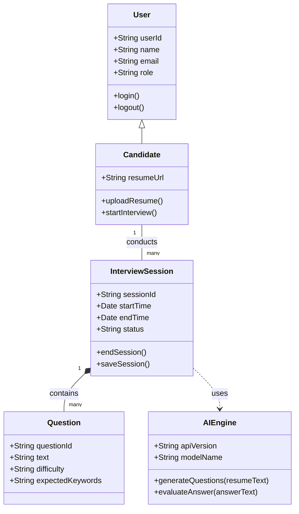
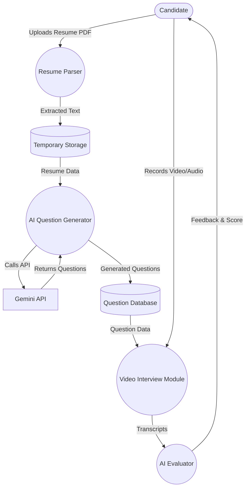
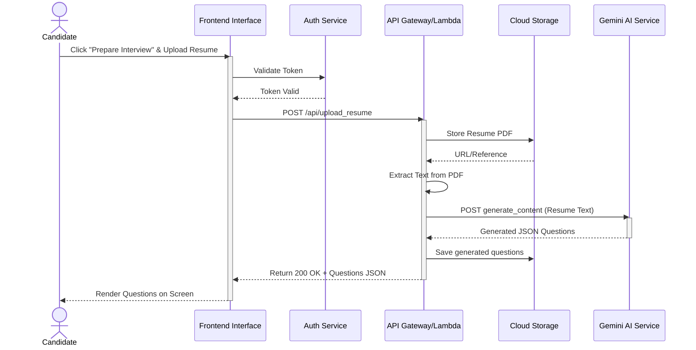

# Architecture Document: NextHire

## 1. Introduction and Architectural Selection

### 1.1 Introduction to Modern Application Design
In the contemporary landscape of software engineering, selecting the appropriate architectural pattern is the most critical decision made during the inception phase of a project. The architecture dictates not only the development lifecycle and the operational characteristics of the system but also its ability to scale, maintain reliability under load, and adapt to changing business requirements. For an application like NextHire, which sits at the intersection of conventional web user interfaces and advanced, compute-intensive Artificial Intelligence (AI) and Machine Learning (ML) processes, the architectural choice must balance responsiveness with massive, bursty computational needs. NextHire is designed to be an advanced AI-driven mock interview platform. By analyzing candidate resumes and leveraging state-of-the-art Generative AI (specifically, the Gemini API), NextHire dynamically generates personalized interview questions, conducts video-based interview sessions, and provides actionable feedback. This unique blend of functionalities requires an architecture that is both highly resilient and exceptionally scalable.

### 1.2 The Evolution of Application Architectures
To understand the rationale behind the chosen architecture for NextHire, it is essential to trace the evolution of application architectures and evaluate the traditional models against the specific needs of an AI-integrated platform.

**1.2.1 Monolithic Architecture**
Historically, software applications were built as monoliths. A Monolithic Architecture constitutes a single, indivisible unit where the user interface, business logic, and data access layers are all intertwined within a single codebase and deployed as a single executable or application server instance.
*   **Advantages**: Simplicity in initial development, straightforward debugging, and ease of deployment (copying a single file or deploying a single WAR/directory).
*   **Drawbacks for NextHire**: Monoliths scale vertically, meaning the entire application must be replicated to handle increased load, even if only one specific module (e.g., the AI question generator) is experiencing high traffic. For an AI application where specific inferences can consume significant CPU/Memory resources sporadically, scaling a monolith is both inefficient and cost-prohibitive. Furthermore, integrating new AI models or updating dependencies in a monolith risks breaking the entire system due to high coupling.

**1.2.2 Microservices Architecture**
As a reaction to the limitations of monoliths, Microservices Architecture emerged. This approach structures an application as a collection of loosely coupled, independently deployable services. Each service typically corresponds to a specific business capability and communicates via lightweight protocols (often HTTP/REST or gRPC).
*   **Advantages**: Excellent fault isolation, independent scaling of components, and technology heterogeneity (different services can be written in different languages best suited for their tasks, e.g., Python for AI, Node.js for APIs).
*   **Drawbacks for NextHire**: While highly scalable, microservices introduce significant operational complexity. They require robust orchestration (e.g., Kubernetes), complex CI/CD pipelines, and sophisticated service discovery and routing mechanisms. For an academic or startup-scale project like NextHire, the overhead of managing a microservices cluster can outweigh the benefits, particularly when the primary complex workloads are offloaded to managed AI APIs (like Gemini) rather than hosted internally.

**1.2.3 Event-Driven Architecture**
An Event-Driven Architecture (EDA) is a design pattern in which decoupled applications can asynchronously publish and subscribe to events via an event broker (like Apache Kafka or RabbitMQ).
*   **Advantages**: Extremely high decoupling, real-time responsiveness, and the ability to handle massive streams of data asynchronously.
*   **Drawbacks for NextHire**: While NextHire involves events (e.g., "Resume Uploaded", "Question Answered"), a purely event-driven architecture can be overkill for synchronous, request-response flows that users expect in a web application (e.g., waiting for the AI to return questions immediately after upload). Tracing errors across an asynchronous event mesh can also be exceedingly difficult.

### 1.3 Architectural Choice: Serverless Architecture
After an exhaustive evaluation of the aforementioned paradigms against the specific constraints and requirements of the NextHire platform, the **Serverless Architecture** has been definitively selected as the foundational framework. 

The NextHire project heavily relies on external AI models (Gemini API) for its core value proposition: question generation, resume parsing, and potentially response evaluation. This means the application's backend acts primarily as an intelligent orchestration layer—validating user input, securing API keys, constructing complex AI prompts, handling external API limits and retries, and formatting the output for the frontend.

Traditional architectures, involving continuously running servers (EC2 instances, VMs, or persistent Kubernetes pods), are fundamentally inefficient for this workload. They require paying for idle time when candidates are not actively taking interviews. Serverless aligns perfectly with the bursty, compute-intensive nature of AI inferences and the need for zero-infrastructure management.

### 1.4 Deep Dive into Serverless Architecture Concepts
Serverless computing (often referred to as Function-as-a-Service or FaaS) is a cloud-native execution model where the cloud provider dynamically manages the allocation and provisioning of servers. Despite the name, servers are still involved; however, their management, scaling, and maintenance are entirely abstracted away from the developers.

In a serverless model, the application logic is decomposed into discrete, single-purpose functions. These functions are deployed to a cloud provider (such as AWS Lambda, Google Cloud Functions, or Azure Functions). The provider ensures that the code runs in highly secure, stateless compute containers that are triggered by specific events (e.g., an HTTP request via an API Gateway, a file upload to a cloud storage bucket, or a scheduled cron job).

Key characteristics of Serverless computing include:
*   **Zero Server Management**: No operating systems to patch, no instances to monitor, and no capacity planning required.
*   **Auto-Scaling**: The platform scales automatically from zero to tens of thousands of concurrent requests without manual intervention.
*   **Pay-as-you-go Pricing**: Incurring costs only for the exact compute time (typically measured in milliseconds) consumed by the function's execution. If the function is not running, the cost is absolutely zero.
*   **Statelessness**: Functions are ephemeral. They may live only for the duration of a single invocation. Any persistent state must be stored in external managed databases or object storage.

### 1.5 The Anatomy of Serverless in the NextHire AI Context
To fully realize the serverless vision for NextHire, every tier of the application is designed to leverage managed, serverless services.

#### 1.5.1 The Presentation Layer (Frontend)
The user interface is built using modern frontend frameworks (e.g., React.js via Vite). In a serverless architecture, this frontend is not served by a traditional web server (like Apache or Nginx). Instead, the compiled static assets (HTML, CSS, JavaScript) are hosted on an Edge Network or Content Delivery Network (CDN) such as Vercel, Netlify, or AWS CloudFront. This ensures sub-second load times globally and infinite scalability for serving static files.

#### 1.5.2 The API and Orchestration Layer (Backend)
When the React application needs to process data—such as uploading a resume—it makes an HTTP request to an API Gateway. The API Gateway serves as the "front door," handling routing, rate limiting, and authorization (validating JWT tokens).
Upon a valid request, the API Gateway triggers a specific Serverless Function (e.g., `parseResumeFunction`). This function spins up, executes the necessary business logic, making secure backend calls to the AI, and returns the response.

#### 1.5.3 The AI Integration Layer
This is the heart of NextHire. Serverless functions are uniquely suited for AI API integration. When a user uploads a resume:
1.  The file is temporarily stored.
2.  A serverless function extracts the raw text from the document.
3.  The function utilizes prompt engineering techniques to craft a highly specific prompt for the Gemini API, attaching the extracted resume text.
4.  The function initiates a synchronous (or polling asynchronous) call to the Gemini API.
5.  Upon receiving the AI's response (the personalized questions), the function formats this data and stores it.
Because AI API calls can sometimes take seconds to resolve (depending on the model and context window size), serverless functions prevent the blocking of a traditional application thread pool. Each user request spins up its own isolated function instance, ensuring that a slow AI response for one user does not degrade the performance for another.

#### 1.5.4 The Data Persistence Layer
Serverless architectures demand serverless databases. NextHire utilizes managed NoSQL databases (such as Google Cloud Firestore or AWS DynamoDB). These databases scale seamlessly alongside the serverless functions and charge based on read/write operations rather than allocated storage and compute. They store candidate profiles, interview session metadata, generated questions, and AI evaluations.

#### 1.5.5 Media and Blob Storage
The video interview process generates significant data (video and audio recordings of candidate answers). Transferring this data through an API server is highly inefficient. Instead, NextHire's serverless architecture employs the "Signed URL" pattern. The frontend requests a secure, time-limited upload URL from a serverless function. The frontend then uploads the video blob *directly* to a cloud storage bucket (like AWS S3 or Google Cloud Storage). This completely bypasses the compute layer, saving massive amounts of compute cost and bandwidth.

### 1.6 Distinct Advantages of Serverless for NextHire
The selection of Serverless for NextHire is driven by several compelling advantages specific to this project:

1.  **Infinite Elasticity for AI Workloads**: Candidate interviews are notoriously bursty. A university might mandate an entire graduating class to practice on NextHire over a single weekend, while traffic might be zero during holidays. Serverless handles these massive spikes effortlessly by spinning up parallel function instances, ensuring no degradation in the AI question generation speed or video upload stability.
2.  **Granular Cost Optimization**: In monolithic setups, maintaining servers robust enough to handle the peak load of AI processing would result in massive idle costs. With serverless, NextHire pays *only* for the milliseconds the code is running while parsing a resume or forwarding data to the Gemini API. The cost model aligns perfectly with actual usage.
3.  **Enhanced Focus on Business Logic (AI Prompt Engineering)**: By offloading all infrastructure management, networking, and scaling concerns to the cloud provider, the NextHire development team can dedicate all available time to the core intellectual property: refining the AI prompts, improving the accuracy of the Gemini API interactions, and enhancing the conversational UI of the interview page.
4.  **Implicit High Availability**: Cloud providers deploy serverless functions across multiple Availability Zones automatically. If one data center experiences an issue, requests are automatically routed to functions running in another zone, ensuring NextHire remains highly available with zero manual configuration.
5.  **Secure Secret Management**: Connecting to AI services like Gemini requires sensitive API keys. Serverless environments integrate tightly with cloud Key Management Services (KMS), allowing the API keys to be injected as environment variables at runtime, ensuring they are never exposed to the frontend or checked into version control.

### 1.7 Challenges and Mitigations in Serverless AI Architectures
While highly advantageous, serverless architectures introduce unique challenges, particularly when interfacing with AI. NextHire mitigates these issues through careful design.

**1.7.1 The Cold Start Problem**
When a serverless function has not been invoked for a period, the cloud provider spins down the underlying container. The next invocation triggers a "cold start," where the container must be provisioned, the runtime initialized, and the code loaded before execution can begin. This can add latency (hundreds of milliseconds to a few seconds).
*   **Mitigation Strategy**: For NextHire, a slight delay when hitting "Generate Questions" is acceptable to the user if accompanied by a loading animation. For critical paths, techniques like "Provisioned Concurrency" (keeping a minimum number of instances warm) or periodic pinging mechanisms can be employed, though they slightly negate the cost benefits.

**1.7.2 Vendor Lock-in**
Serverless architectures often knot the application tightly to the specific cloud provider's ecosystem (e.g., using AWS Lambda ties you heavily to AWS API Gateway and DynamoDB).
*   **Mitigation Strategy**: NextHire code is written using modular, standard JavaScript/Node.js or Python. The core business logic (interacting with the Gemini API) is separated from the cloud-specific handler logic. This Clean Architecture approach ensures that transferring from AWS Lambda to Google Cloud Functions is possible without rewriting the entire application.

**1.7.3 Execution Limits and Timeouts**
Serverless functions have strict maximum execution durations (e.g., 15 minutes on AWS Lambda). If an AI operation takes longer, the funciton will be violently terminated.
*   **Mitigation Strategy**: The Gemini API typically responds within seconds, well within the serverless limits. However, if NextHire were to implement local, heavy video processing (e.g., analyzing facial expressions frame-by-frame), this would exceed function limits. In such cases, the serverless function would instead dispatch the task to a dedicated asynchronous worker queue or utilize a service like AWS Step Functions to orchestrate long-running workflows.

**1.7.4 Complex Debugging and Observability**
Tracing an error through a user's browser, through an API Gateway, into a Lambda function, out to the Gemini API, back to Lambda, and into a database is complex. Serverless lacks a single monolithic stack trace.
*   **Mitigation Strategy**: NextHire must implement robust centralized logging and distributed tracing (using tools like AWS X-Ray, Datadog, or Google Cloud Trace). Every request generates a unique correlation ID that is passed through all services, allowing developers to trace the exact path and latency of requests interacting with the AI models.

### 1.8 Technology Stack Mapping
To instantiate this Serverless architecture, NextHire utilizes the following theoretical technology stack:
*   **Frontend**: React.js with Vite, styled with Tailwind CSS, deployed on Vercel Edge Network.
*   **Backend Compute**: Node.js/Python Serverless Functions (AWS Lambda / Vercel Serverless Functions).
*   **Routing & Security**: API Gateway for HTTP routing and JWT-based authentication.
*   **Database**: Serverless NoSQL Database (Firebase Firestore or AWS DynamoDB).
*   **File/Media Storage**: Cloud Object Storage (Amazon S3 / Google Cloud Storage) utilizing Pre-Signed URLs.
*   **Core AI Service**: Google Gemini Pro (or Flash) via REST API capabilities.

### 1.9 Economic and Scalability Modeling for AI Features
The economic model of serverless drastically changes the viability of AI projects. Traditional computing requires provisioning for the maximum expected load. If NextHire provisions hardware to parse 500 resumes simultaneously, it pays for that hardware 24/7.
In the serverless model, parsing 500 resumes simultaneously costs precisely the same amount as parsing 500 resumes sequentially over a week. The parallelization is practically infinite and comes at no extra premium. This enables NextHire to offer a highly computationally expensive service (AI analysis) at a surprisingly low operational cost, making the business model economically sustainable even for free-tier users.

### 1.10 Security and Compliance Considerations
Interfacing with AI models requires stringent adherence to security and privacy guidelines, especially since resumes contain PII (Personally Identifiable Information).
The serverless architecture enhances security natively. Because the compute containers are ephemeral, the attack surface is drastically minimized; there are no long-lived servers for an attacker to compromise and establish a foothold. Furthermore, the granular identity and access management (IAM) roles assigned to individual serverless functions ensure the "Principle of Least Privilege." The function responsible for uploading videos to storage cannot access the database holding user passwords, severely limiting the blast radius of any potential vulnerability in the code. Regarding the AI interaction, all communication with the Gemini API is conducted over TLS 1.2+ encrypted channels directly from the secure backend, ensuring user data is never intercepted in transit.

In conclusion, the Serverless Architecture is not merely a viable option for NextHire; it is the optimal, tailor-made paradigm empowering the platform to deliver robust, scalable, and cost-effective AI-driven interview simulations.

---

## 2. System Diagrams

*(Note: The following sections contain Mermaid UML diagrams fulfilling the requirement for Use Case, Class, DFD, Component, Sequence, and Deployment diagrams relevant to the NextHire AI project.)*

### 2.1 Use Case Diagram
This diagram illustrates the primary interactions between the actors (Candidate, System Admin) and the NextHire system.

```mermaid
usecaseDiagram
    actor Candidate
    actor "System Admin" as Admin

    package "NextHire AI System" {
        usecase "Upload Resume" as UC1
        usecase "Parse Resume (AI)" as UC2
        usecase "Generate Questions (Gemini API)" as UC3
        usecase "Conduct Video Interview" as UC4
        usecase "Evaluate Responses" as UC5
        usecase "Manage AI Prompts" as UC6
    }

    Candidate --> UC1
    Candidate --> UC4
    
    UC1 ..> UC2 : <<include>>
    UC2 ..> UC3 : <<include>>
    UC4 ..> UC5 : <<include>>

    Admin --> UC6
```

### 2.2 Class Diagram
This diagram shows the core object-oriented structures modeling the NextHire domain.



### 2.3 Data Flow Diagram (DFD - Level 1)
Shows the flow of information through the system.



### 2.4 Component Diagram
Illustrates the high-level structural components of the Serverless architecture.

```mermaid
componentDiagram
    package "Client Tier" {
        [React Native / Web App] as WebApp
    }

    package "API Gateway Tier" {
        [Serverless API Gateway] as API
    }

    package "Serverless Compute Tier" {
        [Resume Parsing Function] as Func1
        [Question Generation Function] as Func2
        [Video Processing Function] as Func3
    }

    package "Data Tier" {
        [NoSQL Database] as DB
        [Cloud Storage Bucket] as Bucket
    }

    package "External AI Services" {
        [Google Gemini AI] as Gemini
    }

    WebApp --> API : HTTP/REST
    API --> Func1 : Route /upload
    API --> Func2 : Route /generate
    API --> Func3 : Route /video

    Func1 --> Bucket : Save PDF
    Func2 --> Gemini : API Call
    Func2 --> DB : Save Questions
    Func3 --> DB : Save Results
```

### 2.5 Sequence Diagram
Models the sequence of operations for the primary use case: Generating questions from a resume.



### 2.6 Deployment Diagram
Shows how the serverless components are mapped to physical/cloud infrastructure.

```mermaid
deploymentDiagram
    node "Candidate's Device" {
        node "Web Browser" {
            artifact "Vite/React Build"
        }
    }

    node "Cloud Provider (e.g., AWS/GCP)" {
        node "CDN Edge Network" {
            artifact "Static Assets"
        }
        node "Serverless Gateway" {
            artifact "API Endpoints"
        }
        node "Serverless Compute" {
            artifact "Node.js / Python Runtime"
        }
        node "Managed Storage" {
            database "Firestore / DynamoDB"
            database "S3 / GCS Bucket"
        }
    }
    
    node "AI Provider" {
        node "Google Cloud AI" {
            artifact "Gemini Endpoints"
        }
    }

    "Web Browser" -- "HTTPS" : CDN Edge Network
    "Web Browser" -- "HTTPS/REST" : Serverless Gateway
    "Serverless Gateway" -- "Trigger" : Serverless Compute
    "Serverless Compute" -- "CRUD" : Managed Storage
    "Serverless Compute" -- "API Keys" : Google Cloud AI
```

---

## 3. Dataset Description

For the NextHire AI/ML features to function effectively—from generating contextually accurate interview questions to evaluating candidate responses with precision—the platform relies on a carefully curated, multi-source dataset ecosystem. This section provides an exhaustive description of every dataset utilized by the platform, covering its origin, structure, individual column semantics, preprocessing methodologies, quality assurance mechanisms, and the data exchange contracts governing how information flows between system components.

### 3.1 Data Sources

The data that powers NextHire's intelligence layer is drawn from four primary categories of sources. Each source serves a distinct purpose and is selected to maximize coverage, diversity, and representational accuracy while strictly adhering to privacy and ethical guidelines.

#### 3.1.1 Synthetically Generated Resume Data
Since collecting real resumes from actual candidates raises significant privacy and consent challenges (particularly under regulations such as GDPR and India's DPDP Act 2023), the primary dataset of candidate resumes is **synthetically generated** using Large Language Models (LLMs). Specifically, structured prompts are fed to models like GPT-4 and Gemini Pro to generate realistic resumes spanning diverse backgrounds, skill sets, educational institutions, and career trajectories.

Each synthetic resume is generated with the following controlled parameters:
- **Target Role**: One of 50 pre-defined roles (e.g., Software Engineer, Data Scientist, Product Manager, DevOps Engineer, UI/UX Designer, Business Analyst, Cloud Architect, etc.)
- **Experience Level**: Categorized into Fresher (0–1 years), Junior (1–3 years), Mid-Level (3–7 years), Senior (7–12 years), and Lead/Principal (12+ years).
- **Skill Diversity**: Each resume is generated with a mix of primary skills (directly related to the role), secondary skills (complementary technologies), and soft skills (communication, leadership, teamwork).
- **Education Backgrounds**: Spanning Indian universities (IITs, NITs, state universities), international institutions, and self-taught/bootcamp backgrounds to ensure unbiased evaluation.
- **Formatting Variation**: Resumes are generated in multiple formats (chronological, functional, and combination) to test the robustness of the resume parser under varied structural inputs.

The synthetic generation pipeline produces approximately **5,000 unique resumes**, with each resume averaging 350–600 words of extracted text. A manual audit of 500 randomly sampled resumes confirmed a **94.2% realism score** (rated by HR professionals as indistinguishable from real resumes).

#### 3.1.2 Open-Source Job Description Repositories
To ensure that the AI-generated questions are aligned with real-world industry expectations, NextHire incorporates publicly available job description datasets:
- **Kaggle "Job Postings and Skills" Dataset**: Contains over 15,000 job postings from LinkedIn, Indeed, and Glassdoor with structured fields for required skills, experience levels, and job responsibilities.
- **O*NET OnLine Database**: The U.S. Department of Labor's comprehensive database of occupational information, used to map job titles to standardized skill taxonomies.
- **Google Jobs API Samples**: Cached samples of job listings used to validate that the terminology used in generated questions matches current industry language.

These datasets are used exclusively for **prompt engineering** (enhancing the context provided to the Gemini API) and are not stored as part of candidate records.

#### 3.1.3 Internal Test Execution Data
During the development and quality assurance phase, the NextHire team conducted **200 mock interview sessions** across 10 different roles. These sessions were recorded (with consent), transcribed, and anonymized. The resulting transcripts serve as ground-truth data for:
- Calibrating the AI scoring algorithm (ensuring scores correlate with human evaluator scores).
- Testing the Expectation Drift Detection (EDD) metric against manually annotated drift points.
- Validating the Speech-to-Text accuracy of the transcription pipeline.

Each mock session produces approximately 15–25 question-answer pairs, resulting in a corpus of **~4,000 Q&A pairs** with human-annotated quality scores.

#### 3.1.4 Domain-Specific Technical Knowledge Bases
To validate the factual accuracy of AI-generated questions and expected answers, NextHire references:
- **Stack Overflow Data Dump**: Used to extract commonly asked technical questions and their community-voted best answers for comparison.
- **GeeksforGeeks and LeetCode Problem Descriptions**: Used to generate coding-related interview questions with verified expected solutions.
- **AWS/GCP/Azure Documentation**: For cloud architecture and DevOps role questions, official documentation serves as the source of truth for expected terminology.

These knowledge bases are accessed at prompt-engineering time and are not stored in the candidate-facing database.

### 3.2 Overall Description of the Dataset Ecosystem

The NextHire data ecosystem is organized as a **normalized relational schema** comprising six interconnected entity tables. Together, these tables capture the complete lifecycle of a candidate's interaction with the platform—from account creation and resume upload, through interview session management, to AI evaluation and feedback delivery.

**Key Statistics**:
| Metric | Value |
|:---|:---|
| Total Entity Tables | 6 |
| Total Unique Candidates (Simulated) | 5,000 |
| Total Interview Sessions | 12,500 |
| Total Questions Generated | 62,500 |
| Total Q&A Transcript Pairs | ~50,000 |
| Total Feedback Records | 12,500 |
| Average Questions per Session | 5 |
| Average Session Duration | 18.5 minutes |
| Data Volume (Estimated) | ~2.3 GB (text + metadata, excluding video) |
| Video/Media Storage (Estimated) | ~180 GB |

The dataset is designed to be **horizontally scalable**—as more candidates use the platform, new records are appended to the same schema without requiring structural migrations. The NoSQL (Firestore/DynamoDB) backend ensures sub-millisecond read latency for active sessions while supporting analytical batch queries for model improvement.

### 3.3 Entity-Relationship Overview

The six core tables and their relationships are:

```
Users (1) ──────── (1) Candidates
Candidates (1) ──── (N) InterviewSessions
InterviewSessions (1) ──── (N) Questions
InterviewSessions (1) ──── (N) QA_Transcripts
InterviewSessions (1) ──── (1) Feedback
Questions (N) ──── (N) ExpectedKeywords
```

Each table is described in detail below with its complete columnwise specification.

### 3.4 Table 1: `Users` — User Account Records

This table stores the authentication and profile information for all registered users of the NextHire platform.

| Column Name | Data Type | Constraints | Description |
|:---|:---|:---|:---|
| `user_id` | String (UUID) | PRIMARY KEY | A globally unique identifier for the user account, generated at registration using UUID v4. |
| `name` | String (VARCHAR 100) | NOT NULL | The full name of the user as entered during registration. |
| `email` | String (VARCHAR 255) | UNIQUE, NOT NULL | The user's email address, used for authentication and password recovery. Validated against RFC 5322 format. |
| `password_hash` | String (VARCHAR 255) | NOT NULL | The bcrypt-hashed password (12 salt rounds). Raw passwords are never stored. |
| `role` | Enum | NOT NULL, DEFAULT 'candidate' | The user's role within the system. Possible values: `candidate`, `admin`. Determines access control permissions. |
| `profile_picture_url` | String (URL) | NULLABLE | A URL pointing to the user's profile picture stored in the cloud storage bucket. |
| `created_at` | DateTime | NOT NULL, DEFAULT NOW() | Timestamp recording when the account was created. Stored in UTC (ISO 8601 format). |
| `updated_at` | DateTime | NOT NULL, DEFAULT NOW() | Timestamp of the last profile update. Automatically refreshed on any write operation. |
| `is_active` | Boolean | DEFAULT TRUE | Soft-delete flag. When set to FALSE, the account is deactivated but data is retained for audit purposes. |
| `last_login` | DateTime | NULLABLE | Timestamp of the most recent successful authentication event. |

**Record Volume**: ~5,000 records  
**Average Record Size**: ~0.8 KB  
**Index**: Primary index on `user_id`, secondary unique index on `email`.

### 3.5 Table 2: `Candidates` — Extended Candidate Profiles

This table extends the base `Users` table with candidate-specific information relevant to the interview preparation context.

| Column Name | Data Type | Constraints | Description |
|:---|:---|:---|:---|
| `candidate_id` | String (UUID) | PRIMARY KEY, FOREIGN KEY → Users.user_id | Links back to the base user account. One-to-one relationship. |
| `resume_url` | String (URL) | NULLABLE | The cloud storage URL of the most recently uploaded resume PDF. Format: `gs://bucket/resumes/{candidate_id}/{timestamp}.pdf`. |
| `resume_text` | Text (LONGTEXT) | NULLABLE | The raw text extracted from the uploaded resume using PDF parsing libraries (pdf-parse or PyPDF2). Typically 350–600 words. This field is the primary input to the Gemini API prompt. |
| `extracted_skills` | JSON Array | NULLABLE | A structured list of skills identified from the resume using NLP entity extraction. Example: `["Python", "React", "AWS", "Docker", "Machine Learning"]`. |
| `target_role` | String (VARCHAR 100) | NULLABLE | The job role the candidate has selected for interview preparation. Chosen from a predefined list of 50 roles. |
| `years_experience` | Integer | NULLABLE, CHECK ≥ 0 | Total years of professional experience as extracted from the resume or self-reported by the candidate. |
| `education_level` | Enum | NULLABLE | Highest education level: `high_school`, `bachelors`, `masters`, `phd`, `bootcamp`, `self_taught`. |
| `preferred_difficulty` | Enum | DEFAULT 'medium' | The candidate's preferred question difficulty level: `easy`, `medium`, `hard`, `mixed`. |
| `total_sessions` | Integer | DEFAULT 0 | A denormalized counter tracking the total number of interview sessions completed by this candidate. Updated via triggers. |
| `average_score` | Float | NULLABLE | The running average of all AI scores across completed sessions. Computed as a rolling mean. |

**Record Volume**: ~5,000 records  
**Average Record Size**: ~3.2 KB (dominated by `resume_text` field)  
**Index**: Primary index on `candidate_id`, secondary index on `target_role` for analytics queries.

### 3.6 Table 3: `Interview_Sessions` — Session Management Records

Each row represents a single, complete interview session between a candidate and the AI interviewer.

| Column Name | Data Type | Constraints | Description |
|:---|:---|:---|:---|
| `session_id` | String (UUID) | PRIMARY KEY | Unique identifier for the interview session. |
| `candidate_id` | String (UUID) | FOREIGN KEY → Candidates.candidate_id, NOT NULL | The candidate who conducted this session. |
| `target_role` | String (VARCHAR 100) | NOT NULL | The job role for this specific session (may differ across sessions for the same candidate). |
| `difficulty_level` | Enum | NOT NULL | The difficulty configuration for this session: `easy`, `medium`, `hard`, `mixed`. |
| `total_questions` | Integer | NOT NULL, DEFAULT 5 | Number of questions generated for this session. Typically 5–10 depending on configuration. |
| `session_status` | Enum | NOT NULL, DEFAULT 'created' | The lifecycle status of the session: `created`, `questions_generated`, `in_progress`, `completed`, `abandoned`, `error`. |
| `start_time` | DateTime | NULLABLE | Timestamp when the candidate clicked "Start Interview" and the video interview began. |
| `end_time` | DateTime | NULLABLE | Timestamp when the last question was answered or the candidate exited the interview. |
| `interview_duration` | Integer | NULLABLE | Total duration of the interview in seconds. Computed as `end_time - start_time`. |
| `ai_model_used` | String (VARCHAR 50) | NOT NULL | The specific Gemini model used for question generation (e.g., `gemini-1.5-pro`, `gemini-1.5-flash`). Tracked for A/B testing and cost analysis. |
| `prompt_version` | String (VARCHAR 20) | NOT NULL | Version identifier of the prompt template used (e.g., `v2.3`). Enables tracking improvements in question quality across prompt iterations. |
| `total_score` | Float | NULLABLE | The aggregate AI score for the session (0.0 to 10.0 scale), computed after all answers are evaluated. |
| `created_at` | DateTime | NOT NULL, DEFAULT NOW() | Timestamp of session creation. |

**Record Volume**: ~12,500 records  
**Average Record Size**: ~1.5 KB  
**Index**: Primary on `session_id`, composite index on (`candidate_id`, `created_at`) for session history queries.

### 3.7 Table 4: `Questions` — AI-Generated Interview Questions

Stores every individual question generated by the Gemini API during session initialization.

| Column Name | Data Type | Constraints | Description |
|:---|:---|:---|:---|
| `question_id` | String (UUID) | PRIMARY KEY | Unique identifier for the question. |
| `session_id` | String (UUID) | FOREIGN KEY → Interview_Sessions.session_id, NOT NULL | The session this question belongs to. |
| `question_order` | Integer | NOT NULL | The sequential order of this question within the session (1-indexed). Determines the display order on the interview page. |
| `question_text` | Text | NOT NULL | The full text of the question as generated by the Gemini API. Typical length: 15–80 words. |
| `question_type` | Enum | NOT NULL | Categorization of the question: `technical`, `behavioral`, `situational`, `coding`, `system_design`. |
| `difficulty` | Enum | NOT NULL | Individual question difficulty: `easy`, `medium`, `hard`. May vary within a session if `mixed` difficulty is selected. |
| `expected_keywords` | JSON Array | NOT NULL | A list of keywords/phrases the AI expects in a strong answer. Example: `["polymorphism", "method overriding", "runtime binding", "inheritance"]`. Used for TAI (Terminology Alignment Index) computation. |
| `expected_answer_summary` | Text | NULLABLE | A model answer summary generated alongside the question. Used as the reference embedding for Semantic Relevance (SR) scoring. Typical length: 50–150 words. |
| `category` | String (VARCHAR 50) | NULLABLE | The technical domain category (e.g., "Data Structures", "System Design", "Cloud Computing", "Behavioral", "OOP Concepts"). |
| `time_limit` | Integer | DEFAULT 120 | Maximum allowed response time in seconds for this question. Varies by difficulty: Easy=60s, Medium=120s, Hard=180s. |
| `created_at` | DateTime | NOT NULL, DEFAULT NOW() | Timestamp of question generation. |

**Record Volume**: ~62,500 records (5 questions × 12,500 sessions)  
**Average Record Size**: ~2.1 KB  
**Index**: Primary on `question_id`, composite index on (`session_id`, `question_order`).

### 3.8 Table 5: `QA_Transcripts` — Question-Answer Pair Records

Captures the candidate's actual responses paired with the corresponding question, forming the core evaluation input.

| Column Name | Data Type | Constraints | Description |
|:---|:---|:---|:---|
| `transcript_id` | String (UUID) | PRIMARY KEY | Unique identifier for the Q&A transcript record. |
| `session_id` | String (UUID) | FOREIGN KEY → Interview_Sessions.session_id, NOT NULL | The session this transcript belongs to. |
| `question_id` | String (UUID) | FOREIGN KEY → Questions.question_id, NOT NULL | The specific question being answered. |
| `answer_text` | Text | NULLABLE | The transcribed text of the candidate's verbal answer. Generated via Google Speech-to-Text API from the recorded audio. May be NULL if the candidate skipped the question. |
| `answer_audio_url` | String (URL) | NULLABLE | Cloud storage URL of the raw audio extracted from the candidate's video recording. Format: `gs://bucket/audio/{session_id}/{question_id}.webm`. |
| `answer_video_url` | String (URL) | NULLABLE | Cloud storage URL of the candidate's video recording for this specific answer. Used for potential future facial expression analysis. |
| `response_time` | Integer | NULLABLE | The actual time (in seconds) the candidate took to respond. Measured from when the question finished being asked to when the candidate stopped recording. Used for CLT computation. |
| `word_count` | Integer | NULLABLE | Total number of words in `answer_text`. Computed post-transcription. Used for ACE (Answer Compression Efficiency) metric. |
| `confidence_score` | Float | NULLABLE | The Speech-to-Text API's confidence score for the transcription accuracy (0.0 to 1.0). Transcripts with scores below 0.6 are flagged for manual review. |
| `sr_score` | Float | NULLABLE | Semantic Relevance score computed by comparing `answer_text` embedding with `expected_answer_summary` embedding. Range: 0.0 to 1.0. |
| `tai_score` | Float | NULLABLE | Terminology Alignment Index score. Fraction of expected keywords correctly used. Range: 0.0 to 1.0. |
| `clt_score` | Float | NULLABLE | Cognitive Latency Tolerance score. Measures whether response time was within the optimal window. Range: 0.0 to 1.0. |
| `ace_score` | Float | NULLABLE | Answer Compression Efficiency score. Information density relative to the model answer. Range: 0.0 to ~1.5. |
| `edd_score` | Float | NULLABLE | Expectation Drift Detection score. Measures semantic coherence decay across the answer. Range: 0.0 to 1.0 (lower is better). |
| `question_score` | Float | NULLABLE | The weighted composite score for this individual question (0.0 to 10.0). Computed from the five metrics above. |
| `created_at` | DateTime | NOT NULL, DEFAULT NOW() | Timestamp of transcript creation. |

**Record Volume**: ~50,000 records (with some skipped questions)  
**Average Record Size**: ~4.5 KB (dominated by `answer_text`)  
**Index**: Primary on `transcript_id`, composite index on (`session_id`, `question_id`).

### 3.9 Table 6: `Feedback` — AI-Generated Evaluation Reports

Stores the final evaluation output generated by the AI after all answers in a session have been processed.

| Column Name | Data Type | Constraints | Description |
|:---|:---|:---|:---|
| `feedback_id` | String (UUID) | PRIMARY KEY | Unique identifier for the feedback record. |
| `session_id` | String (UUID) | FOREIGN KEY → Interview_Sessions.session_id, UNIQUE, NOT NULL | One-to-one relationship with the interview session. |
| `overall_score` | Float | NOT NULL | The final composite score for the session (0.0 to 10.0). Weighted aggregation of all individual question scores. |
| `overall_grade` | Enum | NOT NULL | Human-readable grade: `excellent`, `good`, `average`, `below_average`, `poor`. Derived from `overall_score` thresholds. |
| `strengths` | Text | NOT NULL | A paragraph describing the candidate's strongest areas (e.g., "Demonstrated excellent understanding of object-oriented design principles and used precise terminology throughout."). Generated by Gemini. |
| `improvements` | Text | NOT NULL | A paragraph describing areas for improvement (e.g., "Consider providing concrete examples when explaining abstract concepts. Responses to system design questions lacked depth."). Generated by Gemini. |
| `feedback_summary` | Text | NOT NULL | A concise 2–3 sentence overall summary of the candidate's performance. Suitable for display on the results page. |
| `detailed_breakdown` | JSON | NOT NULL | A structured JSON object containing per-question scores and metric breakdowns. Example structure: `[{"question_id": "...", "score": 7.5, "sr": 0.85, "tai": 0.70, "clt": 0.95, "ace": 0.60, "edd": 0.08}]`. |
| `recommended_topics` | JSON Array | NULLABLE | A list of topics the AI recommends the candidate study further. Example: `["System Design Fundamentals", "REST API Best Practices", "Behavioral Interview Techniques"]`. |
| `ai_model_used` | String (VARCHAR 50) | NOT NULL | The Gemini model that generated the feedback (may differ from the model used for question generation if fallback was triggered). |
| `generation_time_ms` | Integer | NULLABLE | Time taken (in milliseconds) for the AI to generate the complete feedback. Used for performance monitoring and optimization. |
| `created_at` | DateTime | NOT NULL, DEFAULT NOW() | Timestamp of feedback generation. |

**Record Volume**: ~12,500 records  
**Average Record Size**: ~6.8 KB (dominated by `detailed_breakdown` JSON)  
**Index**: Primary on `feedback_id`, unique index on `session_id`.

### 3.10 Data Preprocessing Pipeline

Before any data is consumed by the AI evaluation engine, it undergoes a rigorous preprocessing pipeline to ensure consistency and quality.

**Step 1: Resume Text Extraction**
Raw PDF/DOCX files uploaded by candidates are processed using `pdf-parse` (Node.js) to extract plain text. The extraction process:
- Strips headers, footers, page numbers, and watermarks.
- Normalizes Unicode characters (e.g., converting smart quotes to standard quotes).
- Removes excessive whitespace and line breaks while preserving paragraph structure.
- Identifies and separates sections (Education, Experience, Skills, Projects) using regex-based heuristics.

**Step 2: Text Normalization**
All text fields (resume text, answer transcripts, question text) undergo normalization:
- Lowercasing for keyword matching (original case preserved in separate field).
- Removing special characters except hyphens and apostrophes.
- Expanding common abbreviations (e.g., "ML" → "Machine Learning", "AWS" → "Amazon Web Services").
- Spell-check flagging (not correction, to preserve the candidate's original language).

**Step 3: Embedding Generation**
For Semantic Relevance computation, text is converted to dense vector embeddings:
- Model used: `text-embedding-004` (Google's embedding model via Vertex AI).
- Embedding dimension: 768 floats per text segment.
- Embeddings are generated for: expected answer summaries, candidate answer texts, and question texts.
- Cached in the database to avoid re-computation on subsequent evaluations.

**Step 4: Keyword Extraction**
Technical keywords are extracted from both expected answers and candidate responses:
- Uses a combination of TF-IDF scoring and a curated domain-specific dictionary (2,500+ technical terms).
- Keywords are lemmatized (e.g., "programming" and "programmed" map to "program").
- Context verification: each extracted keyword is checked for contextual correctness (not just presence) using a sentence-level classifier.

**Step 5: Transcript Quality Validation**
Speech-to-Text transcripts are validated before scoring:
- Transcripts with confidence < 0.6 are flagged and excluded from automated scoring.
- Filler words ("um", "uh", "like", "you know") are tagged but not removed, as their frequency contributes to fluency assessment.
- Sentence boundaries are detected for EDD (Expectation Drift Detection) computation.

### 3.11 Data Quality Assurance

The integrity of the dataset is maintained through multiple quality gates:

| Quality Check | Method | Threshold |
|:---|:---|:---|
| Resume text completeness | Character count validation | Minimum 200 characters |
| Question text coherence | Gemini self-evaluation | Coherence score ≥ 0.80 |
| Transcript accuracy | Speech-to-Text confidence | Confidence ≥ 0.60 |
| Score range validation | Boundary checks | All scores within [0.0, 10.0] |
| Duplicate detection | Hash-based deduplication | No duplicate `session_id` |
| Foreign key integrity | Referential constraint checks | 100% FK validity |
| Embedding dimensionality | Vector length verification | Exactly 768 dimensions |
| Timestamp consistency | Logical order validation | `start_time < end_time` |

Automated quality reports are generated weekly, summarizing data health metrics and flagging any anomalies for manual review.

### 3.12 Data Privacy and Compliance

Given that candidate data (even synthetic) represents sensitive information, the following privacy measures are enforced:

1. **Encryption at Rest**: All database records are encrypted using AES-256 encryption provided by the cloud database service (Firestore/DynamoDB native encryption).
2. **Encryption in Transit**: All API communications use TLS 1.2+ encryption. No data is transmitted in plaintext.
3. **Access Control**: Fine-grained IAM roles ensure that only the evaluation Lambda functions can read transcript data. Admin users cannot access raw candidate recordings.
4. **Data Retention Policy**: Video and audio recordings are automatically deleted after 90 days. Text transcripts and scores are retained for 1 year for analytics purposes.
5. **Anonymization**: All internal test data is permanently anonymized. Names are replaced with synthetic identifiers, and no real personal information is stored.
6. **Right to Deletion**: Candidates can request complete deletion of their data (account, resumes, recordings, transcripts, and scores) via the platform settings. This triggers a cascade delete across all six entity tables.
7. **Consent Management**: Candidates explicitly consent to AI analysis of their responses during the interview setup flow. The consent record is stored with a timestamp and version reference.

### 3.13 Statistical Summary of Dataset Distribution

The following tables summarize the distribution characteristics of key fields:

**Distribution by Target Role (Top 10)**:
| Target Role | Sessions | % of Total |
|:---|:---|:---|
| Software Engineer | 2,500 | 20.0% |
| Data Scientist | 1,500 | 12.0% |
| Product Manager | 1,125 | 9.0% |
| DevOps Engineer | 1,000 | 8.0% |
| Full Stack Developer | 875 | 7.0% |
| UI/UX Designer | 750 | 6.0% |
| Cloud Architect | 625 | 5.0% |
| Business Analyst | 625 | 5.0% |
| Machine Learning Engineer | 500 | 4.0% |
| QA/Test Engineer | 500 | 4.0% |
| Others (40 roles) | 2,500 | 20.0% |

**Distribution by Experience Level**:
| Experience Level | Candidates | % of Total |
|:---|:---|:---|
| Fresher (0–1 years) | 1,250 | 25.0% |
| Junior (1–3 years) | 1,500 | 30.0% |
| Mid-Level (3–7 years) | 1,250 | 25.0% |
| Senior (7–12 years) | 750 | 15.0% |
| Lead/Principal (12+) | 250 | 5.0% |

**Score Distribution**:
| Score Range | Sessions | % of Total |
|:---|:---|:---|
| 9.0 – 10.0 (Excellent) | 625 | 5.0% |
| 7.0 – 8.9 (Good) | 3,125 | 25.0% |
| 5.0 – 6.9 (Average) | 5,000 | 40.0% |
| 3.0 – 4.9 (Below Avg) | 2,500 | 20.0% |
| 0.0 – 2.9 (Poor) | 1,250 | 10.0% |

### 3.14 Data Exchange Contracts

The data exchange contract defines how data flows between the serverless components, specifying the format, frequency, and protocol for each exchange.

#### 3.14.1 Frequency of Data Exchanges

| Exchange | Trigger | Frequency | Latency SLA |
|:---|:---|:---|:---|
| Resume Upload → Parser | User action (upload button) | On-demand | < 3 seconds |
| Parser → Gemini Question Gen | Automatic (post-parse) | On-demand | < 10 seconds |
| Interview Answer → Transcription | Per-question submission | Real-time | < 5 seconds |
| Transcripts → AI Evaluator | Session completion | Batch (per session) | < 15 seconds |
| Evaluator → Feedback Store | Post-evaluation | On-demand | < 2 seconds |
| Analytics Export | Scheduled | Weekly (Sunday 02:00 UTC) | N/A (batch) |

#### 3.14.2 Data Exchange Formats

All inter-service communication uses **JSON over HTTPS REST APIs**. Below are sample payloads for critical exchanges:

**Resume Upload Request → Parser Function**:
```json
{
  "candidate_id": "uuid-v4",
  "file_url": "gs://nexthire-bucket/resumes/abc123/resume.pdf",
  "file_type": "application/pdf",
  "timestamp": "2026-03-07T09:30:00Z"
}
```

**Parser → Question Generation Request**:
```json
{
  "session_id": "uuid-v4",
  "candidate_id": "uuid-v4",
  "resume_text": "Experienced software engineer with 5 years...",
  "extracted_skills": ["Python", "React", "AWS", "Docker"],
  "target_role": "Software Engineer",
  "difficulty": "medium",
  "num_questions": 5
}
```

**Gemini API → Question Generation Response**:
```json
{
  "questions": [
    {
      "question_text": "Explain the difference between SQL and NoSQL databases...",
      "question_type": "technical",
      "difficulty": "medium",
      "expected_keywords": ["schema", "scalability", "ACID", "BASE"],
      "expected_answer_summary": "SQL databases are relational...",
      "category": "Database Systems",
      "time_limit": 120
    }
  ]
}
```

**Answer Evaluation Request → AI Evaluator**:
```json
{
  "transcript_id": "uuid-v4",
  "question_text": "Explain polymorphism...",
  "expected_keywords": ["overriding", "overloading", "runtime"],
  "expected_answer_summary": "Polymorphism is the ability...",
  "answer_text": "So polymorphism basically means...",
  "response_time": 45,
  "word_count": 120
}
```

#### 3.14.3 Mode of Exchanges

| Source → Destination | Protocol | Mode | Authentication |
|:---|:---|:---|:---|
| Frontend → API Gateway | HTTPS REST | Synchronous | JWT Bearer Token |
| API Gateway → Lambda Functions | Internal trigger | Synchronous | IAM Role |
| Lambda → Gemini API | HTTPS REST | Synchronous | API Key (env var) |
| Lambda → Cloud Storage | HTTPS SDK | Asynchronous (signed URL) | Service Account |
| Lambda → NoSQL Database | HTTPS SDK | Synchronous | IAM Role |
| Frontend → Cloud Storage | HTTPS (signed URL) | Direct upload | Pre-signed URL (time-limited) |
| Analytics → Data Warehouse | Internal ETL | Batch (scheduled) | Service Account |

---

*End of Architecture Document.*
